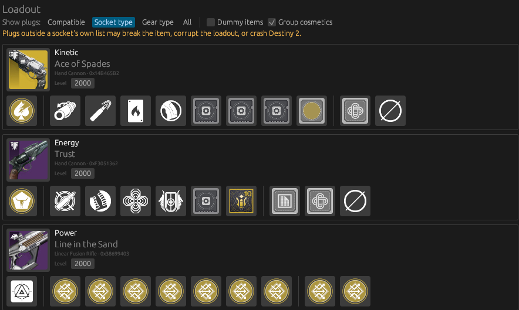

## Panoptes

Panoptes is a graphical tool for editing character loadouts in [Project Sunrise](https://github.com/stanuwu/Sunrise). It is heavily based on [Adept](https://github.com/KyleThmpsn)'s [Sundial](https://github.com/KyleThmpsn/sundial/tree/main).

Panoptes allows for the editing of plugs, a kind of socket system used by Destiny's objects to assign traits or characteristics. Plugs include (but are not limited to) shaders, ornaments, intrinsics, traits, perks, and armor stat rolls - anything that can vary between one copy of a piece of gear and another is likely to use plugs. By setting Panoptes into Socket Type, Gear Type, or All mode, it's possible to put plugs into sockets that they were not intended (creating unique perk combos, and potentially breaking the game in the process). 

Panoptes has a baked-in database of icons and plug data built specifically for Shadowkeep build 86657.20.08.23, and will not function on any newer versions of the game. Panoptes 3.1.0 is only tested to be compatible with Project Sunrise 0.3.1 and up, and will be incompatible with older versions. For Project Sunrise 0.2.1, use the Panoptes 2.1.1 release instead.

The databases used by Panoptes were largely generated by using tiger-pkg to parse the game files (an approach originally used by Sundial). Many thanks go to Adept and Nox for figuring out how armor plugs work.

## AI Disclaimer

Panoptes and Sundial were both built with AI assistance (as was the core Project Sunrise project and most other associated tooling). All code has been human-reviewed, but always take caution when utilizing tools generated by LLMs.

## License

Panoptes is licensed under GPL-3.0. All icons or assets included within Panoptes were sourced from the Bungie.net API, and are the exclusive intellectual property of Bungie Inc. and Sony Interactive Entertainment. Destiny and related intellectual property are owned by Bungie Inc. and their respective rights holders.
